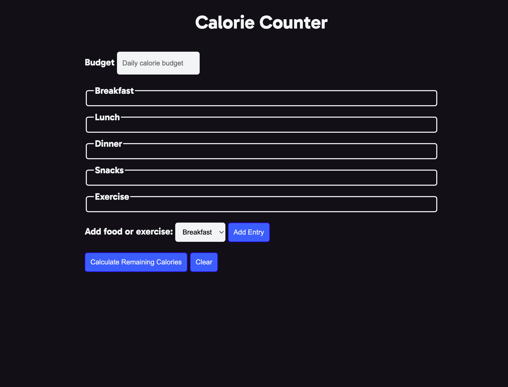

# Calorie Counter

## Description
My motivation was to use my JavaScript skills to create a calorie calculator.
I built this project so that I can practice my JavaScript skills and challenge myself.
It's a one page web application that will take in your daily calorie budget, consumed calories and exercised calories to highlight how many calories you have left to consume or how many calories you over consumed.
What makes my project stand out is that it highlights very important dietary information.

## Installation
No installation is required, to give the app a go use the deployed website link.

## Usage
The following image shows the web application's appearance and functionality:

> **Note**: This layout is designed to be responsive.

The following link will take you to the deployed webpage <https://nateci.github.io/caloriecounter/>

## Tests
Does not require testing.

## Contributors
Nate Cirino

## Questions
For questions about the project, you can reach me at [GitHub: nateci](https://github.com/nateci) or contact me via email at nathanielcirino@gmail.com.
